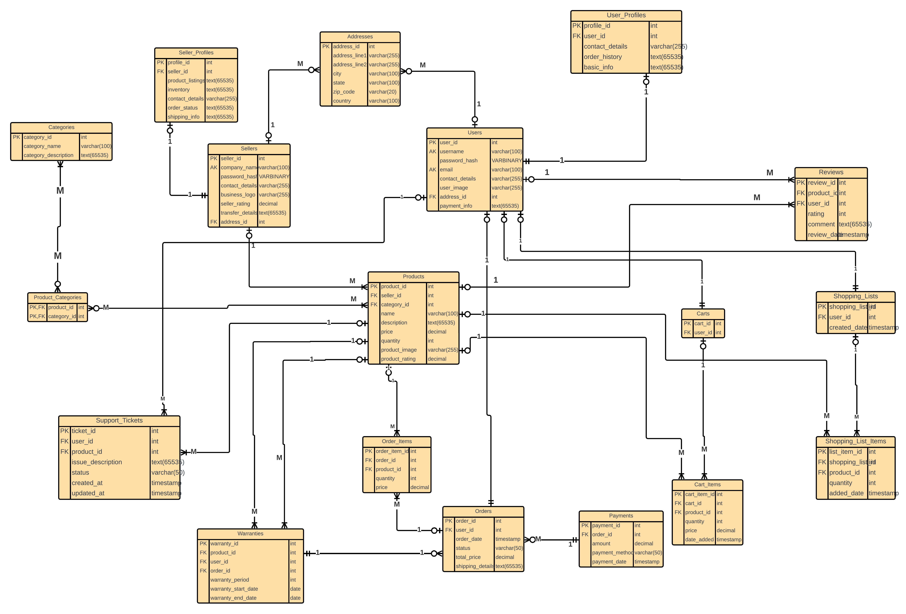
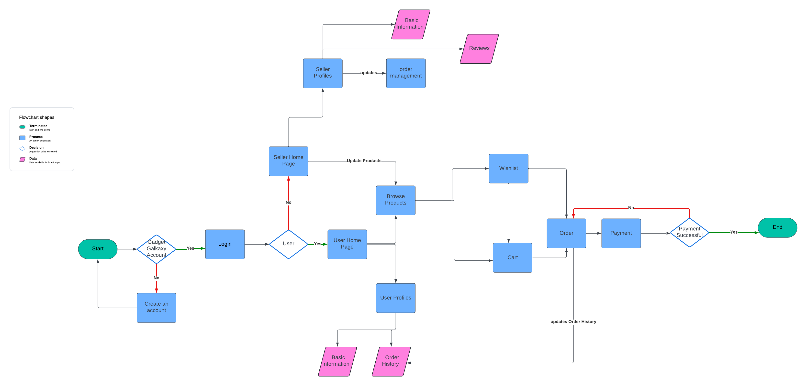

# GadgetGalaxy Database Design and Implementation

## Abstract

GadgetGalaxy is an e-commerce platform for electronic gadgets, designed to provide users and sellers with an intuitive and secure shopping experience. This project was divided into two phases:

1. **SQL Implementation**: Structured relational databases using MySQL to establish normalized schemas for efficient data storage and retrieval.
2. **NoSQL Transition**: Enhanced scalability and flexibility by transitioning to MongoDB, optimizing data structures for unstructured and semi-structured data, and enabling advanced querying for large datasets.

Both phases highlight the challenges of designing robust database systems and showcase the learnings from implementing SQL and NoSQL databases.

---

## Objectives

1. **Design a Scalable Database**: Create a database system to handle the increasing complexity of data (users, products, orders, and reviews).
2. **Improve Data Access**: Optimize queries for performance and ensure data integrity.
3. **Streamline Data Transition**: Seamlessly migrate from a normalized relational database (SQL) to a flexible NoSQL database (MongoDB).
4. **Enhance Usability**: Design user-friendly interfaces to support seamless database interactions.

---

## Challenges Faced

1. **Schema Design**:
   - SQL: Designing a normalized schema while avoiding redundancy and ensuring data consistency.
   - NoSQL: Adopting a schema-less structure and embedding relationships efficiently.

2. **Data Migration**:
   - Ensuring minimal downtime and data integrity during the transition from MySQL to MongoDB.

3. **Performance Optimization**:
   - SQL: Indexing frequently queried fields to improve query execution time.
   - NoSQL: Implementing effective indexing and aggregation pipelines for large datasets.

4. **Data Consistency**:
   - Maintaining consistency and reliability during read/write operations in MongoDB.

5. **Learning Curve**:
   - Understanding the differences between SQL normalization and NoSQL denormalization.

---

## Key Features and Implementation

### SQL Phase Highlights
- **Normalized Schema Design**:
  - Created core tables (Users, Sellers, Products, Orders, Reviews) and auxiliary tables (Addresses, Warranties, Support Tickets).
  - Ensured referential integrity using foreign keys.
  
- **Entity-Relationship (ER) Diagram**:
  - Visualized relationships between entities to plan database structure.
  - **ER Diagram Image**: 
    

- **Data Flow Diagram**:
  - Designed to depict the interaction between users, sellers, and the database.
  - **Data Flow Diagram Image**:
    

- **Indexing and Query Optimization**:
  - Indexed key fields like `user_id`, `product_id`, and `order_id` to speed up data retrieval.
  - Used `EXPLAIN` queries to validate and optimize performance.

---

### NoSQL Phase Highlights
- **Flexible Data Model**:
  - Embedded documents to reduce the need for JOIN operations.
  - Replaced normalized schemas with denormalized structures to optimize read-heavy operations.

- **Advanced Querying and Indexing**:
  - Implemented text indexing for keyword-based product searches.
  - Used aggregation pipelines to calculate metrics like top-selling products and customer purchase trends.

- **Data Migration**:
  - Migrated MySQL data to MongoDB using Studio 3T with minimal downtime.

- **Schema Validation**:
  - Enforced data validation using MongoDB's JSON Schema for critical collections.

---

## How This Project Was Helpful

1. **Enhanced Problem-Solving Skills**:
   - Tackling the transition from SQL to NoSQL improved my ability to design databases tailored to different use cases.

2. **Deepened Database Knowledge**:
   - Learned advanced concepts like indexing, normalization/denormalization, and aggregation pipelines.

3. **Performance Optimization**:
   - Gained practical experience in optimizing database performance through indexing and query optimization.

4. **Real-World Application**:
   - Built a scalable database model for a functional e-commerce platform, gaining insights into real-world data management challenges.

---

## Learnings

1. **SQL Concepts**:
   - Designing normalized schemas, ensuring data consistency, and implementing secure user authentication.

2. **NoSQL Benefits**:
   - Leveraging flexibility and scalability for unstructured data.
   - Understanding the trade-offs between normalized and denormalized schemas.

3. **Data Migration**:
   - Importance of careful planning to ensure data integrity during transitions.

4. **Performance Testing**:
   - Benchmarking query performance and identifying bottlenecks.

---

## Conclusion

The transition from MySQL to MongoDB provided valuable insights into the strengths and trade-offs of SQL and NoSQL databases. While SQL ensures structured data consistency, NoSQL offers the flexibility required for modern, large-scale applications like e-commerce platforms. The experience gained from tackling challenges like data migration, schema design, and performance optimization has enhanced my ability to manage complex database systems effectively.
